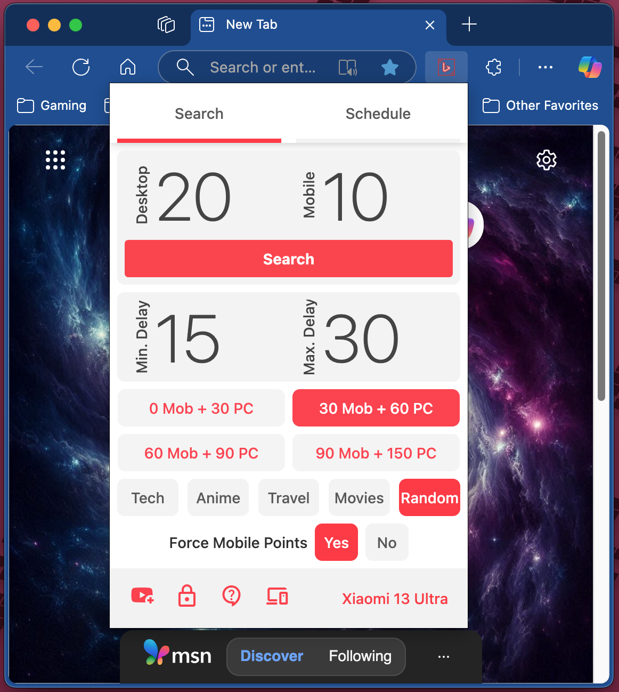

# 🌟 BingRewardsAuto

 <!-- Replace with actual path to your icon -->

**Browser Extension for Edge & Chrome**  
_Earn your daily Bing Rewards Points with just one click!_

---

## 🚀 Overview

Maximize your **Microsoft Rewards** earnings with **BingRewardsAuto** – an automated Bing search extension.  
Designed to streamline your point-earning process, this user-friendly tool offers several key benefits:

---

## ✨ Features

- 🔄 **Hands-free searching** – Automate your Bing searches to save time and effort.  
- ⚙️ **Customizable settings** – Adjust search intervals and volume to match your preferences.  
- 🚫 **Ad-free experience** – Enjoy a clean, distraction-free interface while earning points.  

---

## 📥 Installation

### 🔗 Option 1: Chrome Web Store *(Recommended)*

> Download directly from the **[MS Store](#)**  
> _(Commming soon)_

### 🛠 Option 2: Manual Installation (Developer Mode)

1. Download the ZIP file: `D1AdvocatusBingRewardsAuto.zip`
2. Open your browser (Edge or Chrome)
3. Go to: `chrome://extensions/` or `edge://extensions/`
4. Enable **Developer mode** (top-right toggle)
5. Click **Load unpacked**
6. Select the extracted folder from the ZIP file

---

## 🖼 Screenshot

 <!-- Replace with actual path to your screenshot -->

---

## 💡 Get Started

Start earning more **Microsoft Rewards** points today with this efficient and convenient tool!

---
